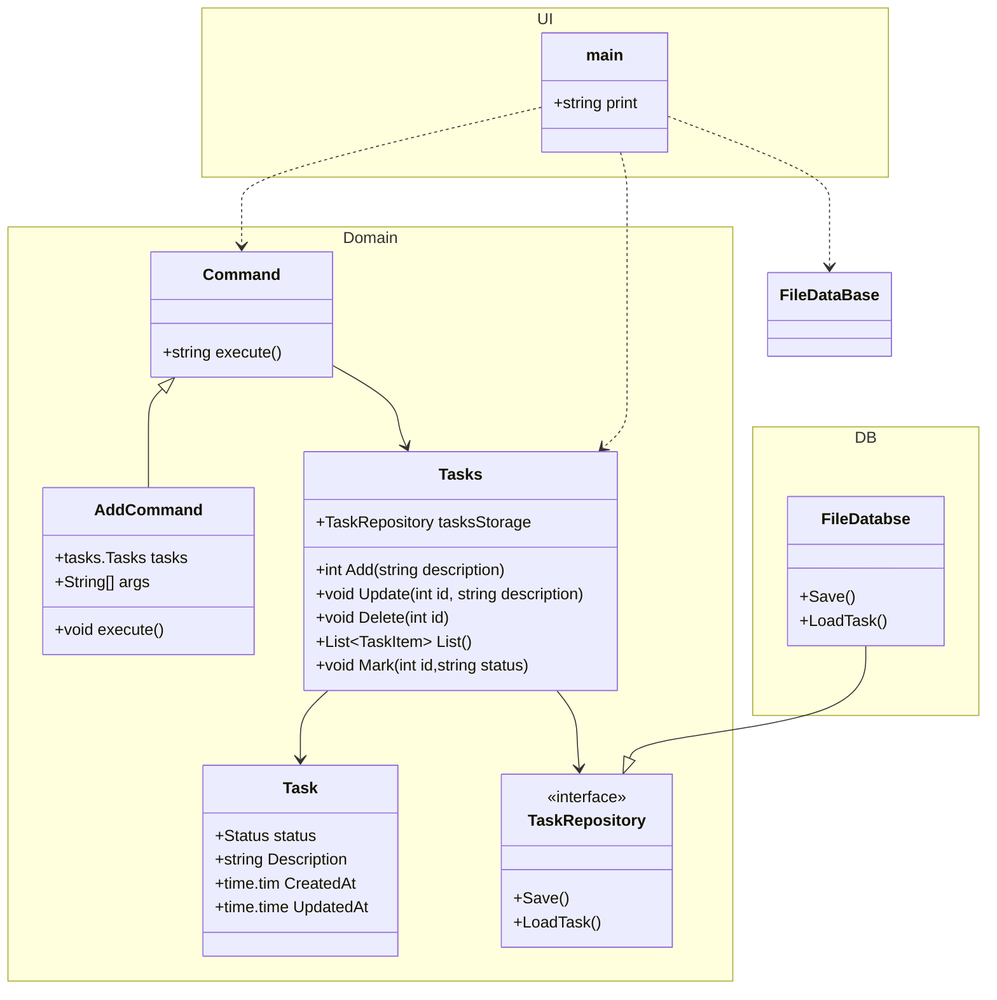

```mermaid
classDiagram
namespace Domain {
    class Task {
        +Status status
        +string Description
        +time.tim CreatedAt
        +time.time UpdatedAt
    }

    class Tasks {
        +TaskRepository tasksStorage
        +int Add(string description)
        +void Update(int id, string description)
        +void Delete(int id)
        +List~TaskItem~ List()
        +void Mark(int id,string status)
    }

    class TaskRepository  {
        <<interface>>
        +Save()
        +LoadTask()
    }

    class Command {
        +string execute()
    }

    class AddCommand {
        +tasks.Tasks tasks
        +String[] args
        +void execute()
    }

}

namespace DB {
    class FileDatabse {
        +Save()
        +LoadTask()
    }
}

namespace UI {
    class main {
        +string print
    }
}


    Command <|-- AddCommand
    Command --> Tasks
    Tasks --> Task
    Tasks --> TaskRepository
    FileDatabse --|> TaskRepository
    main ..> Command
    main ..> Tasks
    main ..> FileDataBase
```
